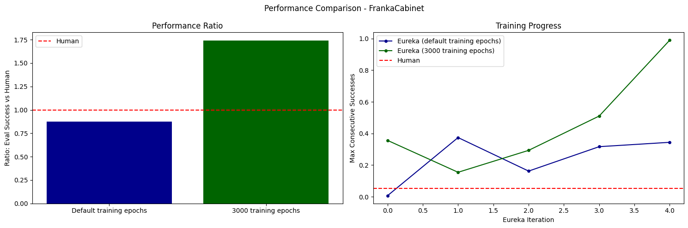

# Eureka artifacts
Outputs of attempts to reproduce Eureka (Ma et. al. 2023).

Currently done for the Ant, Humanoid, and FrankaCabinet tasks.
(rest are WIP)

## Other links
- [Experiment Runs](./experiment_runs.md) to map the folders in this repo to the experiment names

## Navigation
- [Ant Task](#ant-task)
- [Humanoid Task](#humanoid-task)
- [FrankaCabinet Task](#frankacabinet-task)
- [AllegroHand Task](#allegrohand-task) (WIP)
- [ShadowHand Pen Spinning Demo](#shadowhand-pen-spinning-demo)

## Quick summary
- Ant: Training with default epochs beat human baseline
- Humanoid: Does not beat human baseline, unlike in the paper
- FrankaCabinet: Training with epochs=3000 beats human baseline, but default does not

## Ant Task

### Performance Plot

### Evaluation Results
| Default Epochs | 3000 Epochs | Human Baseline |
|:-------------:|:-----------:|:--------------:|
|  |  |  |

### Training Progress

#### Default Epochs Training Progress (Iterations 0-4)
| Iter0 | Iter1 | Iter2 | Iter3 | Iter4 |
|:-----:|:-----:|:-----:|:-----:|:-----:|
|  |  |  |  |  |

#### 3000 Epochs Training Progress (Iterations 0-4)
| Iter0 | Iter1 | Iter2 | Iter3 | Iter4 |
|:-----:|:-----:|:-----:|:-----:|:-----:|
|  |  |  |  |  |

## Humanoid Task

### Performance Plot

### Evaluation Results
| Default Epochs | 3000 Epochs | Human Baseline |
|:-------------:|:-----------:|:--------------:|
|  |  |  |

### Training Progress

#### Default Epochs Training Progress (Iterations 0-4)
| Iter0 | Iter1 | Iter2 | Iter3 | Iter4 |
|:-----:|:-----:|:-----:|:-----:|:-----:|
|  |  |  |  |  |

#### 3000 Epochs Training Progress (Iterations 0-4)
| Iter0 | Iter1 | Iter2 | Iter3 | Iter4 |
|:-----:|:-----:|:-----:|:-----:|:-----:|
|  |  |  |  |  |

## FrankaCabinet Task

### Performance Plot

### Evaluation Results
| Default Epochs | 3000 Epochs | Human Baseline |
|:-------------:|:-----------:|:--------------:|
|  |  |  |

### Training Progress

#### Default Epochs Training Progress (Iterations 0-4)
| Iter0 | Iter1 | Iter2 | Iter3 | Iter4 |
|:-----:|:-----:|:-----:|:-----:|:-----:|
|  |  |  |  |  |

#### 3000 Epochs Training Progress (Iterations 0-4)
| Iter0 | Iter1 | Iter2 | Iter3 | Iter4 |
|:-----:|:-----:|:-----:|:-----:|:-----:|
|  |  |  |  |  |

## AllegroHand Task

### Performance Plot

### Evaluation Results

## ShadowHand Pen Spinning Demo
This is a visualization of the pre-trained pen spinning demo, rather than a result from training.

